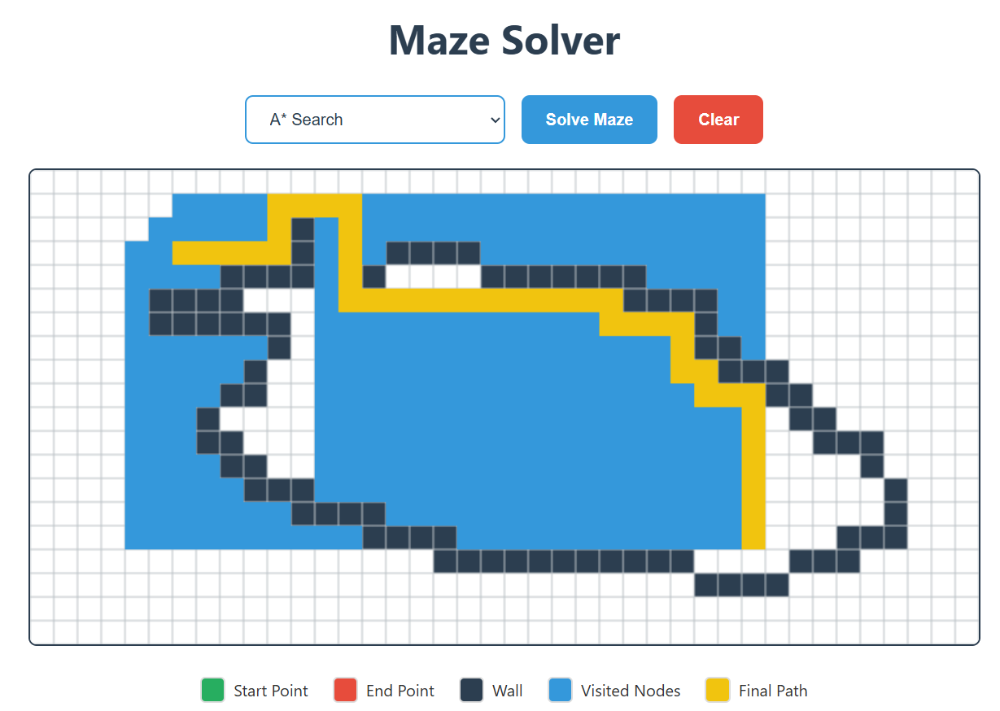
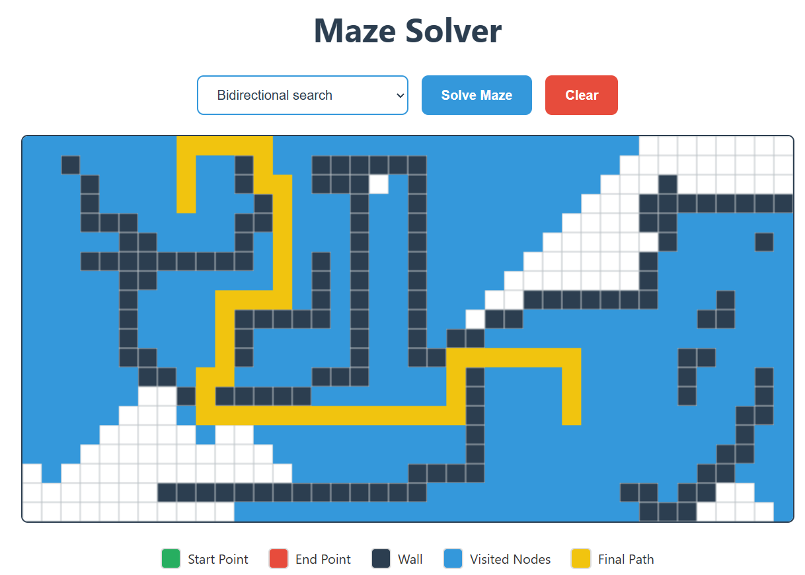
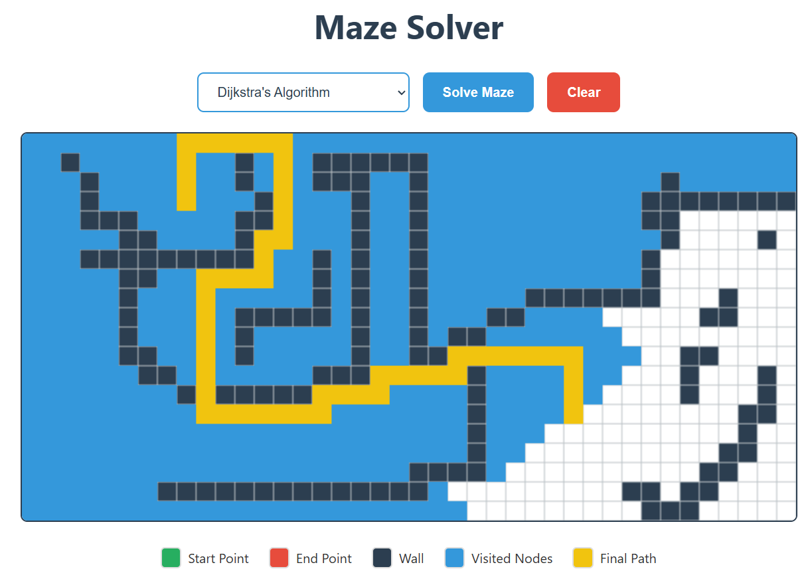

# Maze Solver Visualization

[](https://www.python.org/)
[](https://fastapi.tiangolo.com/)
[](https://developer.mozilla.org/en-US/docs/Web/JavaScript)

A visual simulation tool for pathfinding algorithms with real-time maze customization and algorithm comparison capabilities.

## Visual Demo

<div align="center">
  
   
  
</div>

## Features

### Pathfinding Algorithms
- **Breadth-First Search (BFS)** - Guaranteed shortest path in unweighted grids
- **Depth-First Search (DFS)** - Deep exploration pathfinding
- **Iterative Deepening Depth-First Search (IDDFS)** - Iterative Deepening exploration pathfinding. 
- **A star Search** - Optimal pathfinding with heuristics
- **Dijkstra's Algorithm** - Weighted graph shortest path
- **Bidirectional BFS** - Efficient two-way search


### Core Functionality
- Interactive grid creation with walls/obstacles
- Real-time algorithm visualization
- Step-by-step node visitation animation
- Path length display
- Maze reset/clear functionality

## Technologies

**Backend**
- Python 3.9+
- FastAPI (REST API)
- NumPy (Grid handling)

**Frontend**
- Vanilla JavaScript
- HTML5 Canvas
- CSS3 Animations

## Installation

1. **Clone Repository**
```bash
git clone https://github.com/yourusername/maze-solver.git
cd maze-solver